# Análisis profundo — `mi_base_local` (Sistema de Emergencias Agropecuarias)

> Conexión: `127.0.0.1:3306`, usuario `root` (sin password), base `mi_base_local`, MySQL **9.6.0** (Homebrew).
> Tablas: **52 base** + **4 vistas**. Total filas ≈ **1,2 M**.

## 1. Visión general del dominio

La base soporta un sistema (PHP/MySQL, estilo "Notix") para gestionar **Declaraciones Juradas (DDJJ) de productores agropecuarios** afectados por emergencias en la provincia de **Corrientes** (Argentina), de acuerdo a Resoluciones provinciales/nacionales (Ley 5978 / Ley Nacional 26509). El flujo es:

1. Se registra un **Productor** (`productores`) con su **Domicilio** (`domicilios`) y **Establecimiento** principal (`establecimientos`).
2. Para cada Resolución de emergencia (`resoluciones`) el productor presenta una **DDJJ** (`ddjj_personas`), que es la unidad central del sistema (PK `id_ddjj`).
3. La DDJJ se descompone por **rubro** en:
   - Producción agrícola (`agricultura`, ligada a `cultivos` / `cultivostipo`).
   - Ganadería: `bovinos`, `ovinos`, `porcinos`, `avicultura`, `apicultura`.
   - Forestal: `forestacion`.
   - Mejoras / Invernáculos / Plurianuales: `perdidas_mejoras`, `perdidas_invernaculos`, `perdidas_plurianuales`.
   - Adremas / parcelas: `adremas` (catastro fiscal).
   - Seguros existentes: `seguro_agricola`.
4. Cada DDJJ tiene **adjuntos** (`documentacion`, `fotos`) y **ponderaciones** calculadas (`ponderaciones_ddjj`, `AnalisisOvinos`, `AnalisisOtrasMejoras`).
5. Hay un módulo de administración (`menu_admin`, `submenu_admin`, `permisos_admin`, `permisos_submenu_admin`, `usuarios_notix`).

### Estado técnico de la base

| Aspecto | Observación |
| --- | --- |
| Motor | **MyISAM** en la inmensa mayoría de tablas (≈ 50 de 52). Solo `productores`, `AnalisisOtrasMejoras`, `AnalisisOvinos`, `tipoactividad`, `tipodocumento` usan **InnoDB**. |
| Foreign keys reales | **0 declaradas.** Todas las relaciones son lógicas, por convención de nombres. Esto explica que se vean huérfanos (p. ej. 219 `adremas` con `id_establecimiento = 0`). |
| Charset/columnas | Muchos campos `varchar` muy anchos (500–1000) y categóricos repetidos como texto (provincia, departamento, etc.). |
| Defaults raros | Varias columnas declaradas `NOT NULL` pero sin default sensato; se ven fechas `0000-00-00` y valores `NULL`/0 mezclados. |
| Tablas espejo | `ddjj_personas` ↔ `ddjj_personas_temp` (mismo esquema, ~32 k vs ~20 k filas; la `_temp` parece ser staging). `productos` ↔ `productos_bkp` (backup). |

---

## 2. Modelo lógico (diagrama)

> Las flechas son **relaciones inferidas** porque la base no las declara como FK.

```mermaid
erDiagram
    productores ||--o{ ddjj_personas : "id_productor"
    productores }o--|| domicilios : "DomicilioId"
    productores }o--|| establecimientos : "EstablecimientoId"
    productores }o--|| tipodocumento : "TipoDocumentoId"
    productores }o--|| tipojuridico : "TipoJuridicoId"
    productores }o--|| tipoactividad : "EsPrincipalActividadEconomica"
    productores }o--|| usuarios_notix : "usuario"

    domicilios }o--|| provincias : "ProvinciaId"
    domicilios }o--|| departamentos : "DepartamentoId"
    domicilios }o--|| localidades : "LocalidadId"
    domicilios }o--|| parajes : "ParajeId"
    departamentos }o--|| provincias : "ProvinciaId"
    localidades }o--|| departamentos : "DepartamentoId"
    parajes }o--|| departamentos : "DepartamentoId"

    resoluciones ||--o{ ddjj_personas : "id_resolucion"
    usuarios_notix ||--o{ ddjj_personas : "id_usuario"

    ddjj_personas ||--o{ establecimientos : "ddjj"
    ddjj_personas ||--o{ adremas : "ddjj"
    ddjj_personas ||--o{ agricultura : "ddjj"
    ddjj_personas ||--o{ bovinos : "idddjj"
    ddjj_personas ||--o{ ovinos : "idddjj"
    ddjj_personas ||--o{ porcinos : "idddjj"
    ddjj_personas ||--o{ apicultura : "idddjj"
    ddjj_personas ||--o{ avicultura : "idddjj"
    ddjj_personas ||--o{ forestacion : "idddjj"
    ddjj_personas ||--o{ seguro_agricola : "idddjj"
    ddjj_personas ||--o{ perdidas_mejoras : "idddjj"
    ddjj_personas ||--o{ perdidas_invernaculos : "ddjj"
    ddjj_personas ||--o{ perdidas_plurianuales : "ddjj"
    ddjj_personas ||--o{ documentacion : "idddjj"
    ddjj_personas ||--o{ fotos : "iddjj"
    ddjj_personas ||--o{ ponderaciones_ddjj : "id_ddjj"
    ddjj_personas ||--o{ AnalisisOtrasMejoras : "SolicitudId"

    establecimientos ||--o{ adremas : "id_establecimiento"
    adremas }o--|| tipoactividad : "actividad"
    adremas }o--|| tipotenencia : "tenencia"

    agricultura }o--|| cultivostipo : "tipo_cultivo"
    agricultura }o--|| cultivos : "id_cultivo"
    cultivos }o--|| cultivostipo : "cultivotipoid"
    cultivosprecios }o--|| cultivos : "cultivoid"

    productos }o--|| productostipo : "productotipoid"
    productos }o--|| tipoactividad : "actividadid"
    productos }o--|| Unidades_medida : "medida"
    productostipo }o--|| tipoactividad : "id_actividad"
    op }o--|| productostipo : "productotipoid"
    op }o--|| tipoactividad : "actividadid"

    ponderaciones_ddjj }o--|| rubro_tipos : "rubro"

    menu_admin ||--o{ submenu_admin : "idpadre"
    usuarios_notix ||--o{ permisos_admin : "iduser"
    menu_admin ||--o{ permisos_admin : "idmenu"
    usuarios_notix ||--o{ permisos_submenu_admin : "iduser"
    submenu_admin ||--o{ permisos_submenu_admin : "idsubmenu"
```



---

## 3. Núcleos de información

### 3.1 Núcleo "Persona / Productor"

`productores` (24 449 filas, InnoDB) es la entidad maestra de productores agropecuarios.

| Columna | Tipo | Rol |
| --- | --- | --- |
| `ProductorId` | int PK auto | Identidad |
| `DomicilioId` | int → `domicilios.DomicilioId` | Dirección |
| `EstablecimientoId` | int → `establecimientos.id_establecimiento` | Campo / chacra principal |
| `ProductorDenominacion` | varchar(50) | Nombre completo / razón social |
| `TipoDocumentoId` | int → `tipodocumento` | DNI/LE/LC/etc. |
| `DocumentoNro` | varchar(18) UNIQUE | Documento |
| `Sexo` | char(1) | M / F / S |
| `CUITCUIL` | varchar(18) | CUIT |
| `DGR` | varchar(18) | Nro inscripción DGR |
| `TipoJuridicoId` | int → `tipojuridico` | Persona física, S.A., S.H., etc. |
| `EsPrincipalActividadEconomica` | tinyint → `tipoactividad.TipoActividadId` | Actividad principal (¡el nombre engaña, es el FK!) |
| `Base` | varchar(20) | Origen del registro |
| `renspa` | varchar(100) | RENSPA SENASA |
| `usuario` | int → `usuarios_notix.id` | Quién cargó |

Detalle importante: la columna `EsPrincipalActividadEconomica` —pese al nombre— es usada como FK a `tipoactividad` (lo confirma la vista `vw_productores`).

`vw_productores` es la **vista canónica** para mostrar un productor con toda su geografía resuelta (decodifica "OTRO" usando los campos `*_Otro` de `domicilios`).

### 3.2 Núcleo "Geografía"

Catálogo jerárquico con doble representación (id + texto desnormalizado).

```
provincias ──< departamentos ──< localidades
                      └────────< parajes
domicilios FK→ provincias / departamentos / localidades / parajes
```

- `provincias` (24 filas, las provincias argentinas).
- `departamentos` (107). Tiene `ProvinciaId` (no PK pero usado como FK).
- `localidades` (175) y `parajes` (1 242) cuelgan de departamento.
- `domicilios` (47 432) referencia todos los IDs, **y además** guarda copias en texto para casos "OTRO" (`LocalidadOtro`, `ParajeOtro`, `DepartamentoOtro`) y un par `(lat, lng)` GPS.

⚠️ La misma información geográfica se duplica como texto en `ddjj_personas` (campos `provincia`, `departamento`, `localidad`, `paraje`, etc.) y en `establecimientos` (`departamento_estab`, `localidad_estab`, `paraje_estab`). Es desnormalización histórica para impresión.

### 3.3 Núcleo "Establecimiento + Adremas"

- `establecimientos` (32 363 filas) — chacras, con coordenadas (`latitud`, `longitud`), datos catastrales (`corenea`) y dirección. Cada uno apunta a una `ddjj_personas` (campo `ddjj`).
- `adremas` (41 169 filas) — **parcelas/cuentas catastrales** de un establecimiento. Tipo: superficie, tenencia (FK `tipotenencia`) y actividad (FK `tipoactividad`). 219 adremas tienen `id_establecimiento=0` (huérfanas).

Vista `get_adremas` resuelve `adrema → establecimiento → ddjj → productor` con sus textos (actividad y tenencia).

### 3.4 Núcleo "DDJJ — la unidad de declaración"

**`ddjj_personas`** (32 423 filas) es el centro del sistema. La versión `ddjj_personas_temp` (19 868) es staging y comparte esquema 1-a-1.

Campos clave:

| Columna | Significado |
| --- | --- |
| `id_ddjj` | PK |
| `id_productor` | FK lógico → `productores` (99,96 % matchea) |
| `id_resolucion` | FK lógico → `resoluciones` |
| `fecha` | Fecha de carga |
| `nombre`, `tipo_doc`, `num_doc`, `cuit`, `renspa` | Copia desnormalizada del productor |
| `provincia` … `casa` | Copia desnormalizada del domicilio |
| `telefono1/2/3` | Teléfonos |
| `paso` | Wizard step (1–7) |
| `cargado` | Bandera "carga completa" |
| `id_usuario` | Operador (`usuarios_notix.id`) |
| `estado` | Estado del trámite |
| `impreso`, `fechaimpreso` | Si ya se imprimió el certificado |
| `pondf` | **Ponderación final** (% de daño total calculado) |
| `dea` | Flag DEA |

Cada DDJJ tiene **un solo registro** en muchas tablas de rubro (counts coinciden 32 393 ≈ filas DDJJ con esos rubros activos): el sistema crea las filas en blanco para cada rubro al abrir la DDJJ.

### 3.5 Núcleo "Producción declarada por rubro"

Todas las siguientes tablas se relacionan con `ddjj_personas` por el campo `idddjj` (o `ddjj`).

| Tabla | Filas | Qué guarda | Patrón típico de columnas |
| --- | --- | --- | --- |
| `agricultura` | 43 346 | Una fila **por cultivo** dentro de la DDJJ | `tipo_cultivo`, `id_cultivo`, `sup_sembrada`, `sup_afectada`, `prod_estimada`, `prod_obtenida`, `estado`, `porcentaje` |
| `bovinos` | 32 393 | Existencias y precios de **vaca/vaquillona/ternero/novillo/novillito/toro/búfalo/carne** | Para cada categoría: `precXXX`, `cantiXXX`, `mortaXXX`, `XXXestimada`, `XXXobtenida`, `XXXperdida` |
| `ovinos` | 32 393 | Ovinos: cabezas, mortandad, **corderos** y **lana** | `precovi`, `canticabe`, `mortacabe`, `prodcor`, `corobte`, `preclana`, `prodlana`, `lanaobte`, etc. |
| `porcinos` | 32 393 | Porcinos: cabezas y mortandad | similar a ovinos pero más sencillo |
| `avicultura` | 6 412 | Aves: superficie de uso, existencia/perdida, producción | `precavi`, `existencia`, `perdida`, `prodnor`, `prodobte` |
| `apicultura` | 6 192 | Colmenas y miel | `cantcol`, `canafec`, `precmiel`, `prodnormiel`, `prodobtemiel`, `mielperdida` |
| `forestacion` | 6 285 | Madera, postes, resina, viveros | `precmadera`, `prodmaes`/`prodmaob`, `precposte`, `precresi`, `precvive` |
| `perdidas_mejoras` | 193 624 | Una fila **por tipo de mejora** declarada (pasturas, canales, alambrados, etc.) | `mejora`, `vestimado`, `incidencia`, `pesesp`, `pesper` |
| `perdidas_invernaculos` | 7 365 | Daño en coberturas plásticas y estructuras | `cobertura_plasticas`, `estructuras`, `supsemb`, `supafect` |
| `perdidas_plurianuales` | 9 | Cultivos plurianuales (citrus, té, yerba) | `cobertura_plantas`, `dano_planta` |
| `seguro_agricola` | 32 298 | Si tiene seguro/crédito | `evento`, `cultivo`, `asistencia`, `entidad` |

**Tablas auxiliares de precios** (parametrización):
`cultivosprecios`, `forestalprecios`, `ganaderiaprecios`, `otrasprecios`, `perdidas_invernaculos_precios`, `perdidas_plurianuales_precios`. Son catálogos pequeños con precios unitarios usados por los cálculos.

**Tablas de pesos para fórmulas**:
`afecta_forestal` (5 filas), `afecta_ganaderia` (4), `afecta_otras` (4) — coeficientes (`tipo`, `valor`) que ponderan el peso de cada componente al calcular el % de daño.

### 3.6 Núcleo "Ponderaciones y análisis"

- `ponderaciones_ddjj` (97 018 filas) — pivote ancho con una fila por **(DDJJ, rubro)**. `rubro` referencia `rubro_tipos` (1=Agrícola, 2=Ganadería, 3=Forestal, 4=…, 5=…). Para cada combinación guarda `estimados`, `obtenidos`, `perdidas_ponde`. Sumadas se vuelcan en `ddjj_personas.pondf`.
- `AnalisisOtrasMejoras` (25 filas, InnoDB) — análisis detallado de mejoras para algunas DDJJ. `SolicitudId` matchea con `ddjj_personas.id_ddjj`.
- `AnalisisOvinos` (vacía, InnoDB) — esqueleto para análisis ovino. `AnalisisGanaderiaId` parece apuntar a una futura tabla de análisis de ganadería.

### 3.7 Núcleo "Productos / Cultivos / Catálogos"

```
tipoactividad ──< productostipo ──< productos ──> Unidades_medida
                                       │
cultivostipo ──< cultivos ──< cultivosprecios
cultivosestado     (estados de un cultivo: SIEMBRA, FLORACION, etc.)
```

- `tipoactividad` (13) — AG, GA, BM (agricultura, ganadería, bosques/montes) y similares.
- `productostipo` (21) — agrupa productos por tipo (Cereales, Forrajeras, etc.), ligado a actividad.
- `productos` (107) — catálogo maestro con precio, unidad y `medida` (FK Unidades_medida). `productos_bkp` es backup.
- `cultivos` (207) / `cultivostipo` (11) / `cultivosprecios` (106) / `cultivosestado` (6) — catálogos específicos del módulo agrícola.
- `op` (3) — pequeño catálogo de "otros productos" (ave, colmena, miel).
- `Unidades_medida` (6) — KG, DOCENA, TN, etc.
- `rubro_tipos` (4) — agrupa por rubro económico para reportes.

### 3.8 Núcleo "Administración / Usuarios / Permisos"

```
menu_admin ──< submenu_admin
usuarios_notix ──< permisos_admin ──> menu_admin
usuarios_notix ──< permisos_submenu_admin ──> submenu_admin
```

- `usuarios_notix` (75) — usuarios del backoffice; password en MD5 (`pass`) y un `pass_app` (igual constante "mptt2017", llamativo, parece un dato compartido). ⚠️ riesgo de seguridad.
- `menu_admin` (17) + `submenu_admin` (55) — estructura del menú web.
- `permisos_admin` (354) y `permisos_submenu_admin` (978) — ACL por usuario.

### 3.9 Núcleo "Resoluciones / Documentación / Adjuntos"

- `resoluciones` (7) — define cada acto administrativo (ejemplo: "EMERGENCIA AGROPECUARIA 32/19"). Cabeza y pie del certificado están en HTML, listos para impresión.
- `documentacion` (322 411) — checklist de documentación adjuntada por DDJJ (sí/no + contenido). Es la tabla más grande de la base.
- `fotos` (13) — archivos asociados a la DDJJ (nombre del archivo en disco).

---

## 4. Vistas

| Vista | Para qué sirve |
| --- | --- |
| `vw_productores` | Productor "deslnormalizado" con toda la geografía resuelta. Pieza clave del frontend. |
| `vw_productos` | Producto enriquecido con su tipo, actividad y unidad. |
| `vw_productos_tipo` | Tipo de producto con su actividad asociada. |
| `get_adremas` | Adrema con productor y establecimiento (aplana 5 joins). |

---

## 5. Mapa de FK lógicas (resumen tabular)

| Origen | Columna | → | Destino | Notas |
| --- | --- | --- | --- | --- |
| `productores` | `DomicilioId` | → | `domicilios.DomicilioId` | 1–1 |
| `productores` | `EstablecimientoId` | → | `establecimientos.id_establecimiento` | 1–1 principal |
| `productores` | `TipoDocumentoId` | → | `tipodocumento.TipoDocumentoId` | |
| `productores` | `TipoJuridicoId` | → | `tipojuridico.TipoJuridicoId` | |
| `productores` | `EsPrincipalActividadEconomica` | → | `tipoactividad.TipoActividadId` | nombre engañoso |
| `productores` | `usuario` | → | `usuarios_notix.id` | apenas usado |
| `domicilios` | `ProvinciaId/DepartamentoId/LocalidadId/ParajeId` | → | catálogos respectivos | |
| `departamentos` | `ProvinciaId` | → | `provincias.ProvinciaId` | |
| `localidades` | `DepartamentoId` | → | `departamentos.DepartamentoId` | |
| `parajes` | `DepartamentoId` | → | `departamentos.DepartamentoId` | |
| `ddjj_personas` | `id_productor` | → | `productores.ProductorId` | 1 productor : N DDJJ |
| `ddjj_personas` | `id_resolucion` | → | `resoluciones.id_resolucion` | |
| `ddjj_personas` | `id_usuario` | → | `usuarios_notix.id` | quién carga |
| `establecimientos` | `ddjj` | → | `ddjj_personas.id_ddjj` | 32 362 / 32 363 matchean |
| `adremas` | `ddjj` | → | `ddjj_personas.id_ddjj` | |
| `adremas` | `id_establecimiento` | → | `establecimientos.id_establecimiento` | 219 huérfanos |
| `adremas` | `actividad` | → | `tipoactividad.TipoActividadId` | |
| `adremas` | `tenencia` | → | `tipotenencia.id` | |
| `agricultura` | `ddjj` | → | `ddjj_personas.id_ddjj` | |
| `agricultura` | `tipo_cultivo` | → | `cultivostipo.id` | |
| `agricultura` | `id_cultivo` | → | `cultivos.id` | |
| `bovinos/ovinos/porcinos/avicultura/apicultura/forestacion` | `idddjj` | → | `ddjj_personas.id_ddjj` | |
| `perdidas_mejoras` | `idddjj` | → | `ddjj_personas.id_ddjj` | |
| `perdidas_invernaculos/plurianuales` | `ddjj` | → | `ddjj_personas.id_ddjj` | |
| `documentacion` | `idddjj` | → | `ddjj_personas.id_ddjj` | |
| `fotos` | `iddjj` | → | `ddjj_personas.id_ddjj` | OJO: nombre `iddjj`, sin doble d |
| `seguro_agricola` | `idddjj` | → | `ddjj_personas.id_ddjj` | |
| `ponderaciones_ddjj` | `id_ddjj` | → | `ddjj_personas.id_ddjj` | |
| `ponderaciones_ddjj` | `rubro` | → | `rubro_tipos.id_rubro` | |
| `AnalisisOtrasMejoras` | `SolicitudId` | → | `ddjj_personas.id_ddjj` | confirmado |
| `productos` | `productotipoid` | → | `productostipo.id` | |
| `productos` | `actividadid` | → | `tipoactividad.TipoActividadId` | |
| `productos` | `medida` | → | `Unidades_medida.MedidaId` | |
| `productostipo` | `id_actividad` | → | `tipoactividad.TipoActividadId` | |
| `cultivos` | `cultivotipoid` | → | `cultivostipo.id` | |
| `cultivosprecios` | `cultivoid` | → | `cultivos.id` | |
| `op` | `actividadid` / `productotipoid` | → | `tipoactividad` / `productostipo` | |
| `submenu_admin` | `idpadre` | → | `menu_admin.id` | |
| `permisos_admin` | `iduser` / `idmenu` | → | `usuarios_notix` / `menu_admin` | |
| `permisos_submenu_admin` | `iduser` / `idsubmenu` | → | `usuarios_notix` / `submenu_admin` | |

---

## 6. Hallazgos y riesgos

1. **Falta total de FOREIGN KEYS declaradas** y mezcla MyISAM/InnoDB: si se borra un productor manualmente quedan filas huérfanas en cascada (DDJJ, ganadería, etc.). Hay 219 `adremas` ya huérfanos.
2. **Datos categóricos duplicados como texto** (provincia, departamento, localidad, paraje en `ddjj_personas` y en `establecimientos`). Cualquier reporte fino debe usar `domicilios` + catálogos, no la copia textual.
3. **Posibles inconsistencias DDJJ ↔ Productor**: 13 DDJJ no matchean con `productores` (32 410 / 32 423).
4. **Staging sin proceso de cierre**: `ddjj_personas_temp` tiene ~20 k filas que parecen no haber sido migradas a la tabla definitiva.
5. **Backup conviviendo en la base**: `productos_bkp` (210 filas vs 107 en `productos`) no debería estar en producción.
6. **Seguridad**: `usuarios_notix.pass` es MD5 sin salt, y `pass_app` es la cadena constante `mptt2017` para todos (75/75). Cambiar urgentemente.
7. **Fechas inválidas**: muchos `fechaAlta = '0000-00-00'` y campos NOT NULL sin default razonable. Inconvenientes con `sql_mode=STRICT`.
8. **Convenciones inconsistentes** de nombres: a veces `idddjj`, otras `id_ddjj`, otras `ddjj`, e incluso `iddjj` (en `fotos`). Hay que tenerlo en cuenta al escribir joins.
9. **Vista `get_adremas`** usa un `JOIN` (no `LEFT JOIN`) con `tipoactividad` y `tipotenencia`. Si una adrema tiene una actividad inválida no aparece.
10. **`adremas.actividad` y `adremas.tenencia` son `varchar` pero almacenan IDs**: debería ser `int` para integridad.

---

## 7. Consultas útiles para empezar

> 1. Productor con sus DDJJ y resoluciones:

```sql
SELECT p.ProductorDenominacion, p.CUITCUIL,
       r.nombre_resolucion, dj.fecha, dj.pondf AS pct_dano
FROM productores p
JOIN ddjj_personas dj ON dj.id_productor = p.ProductorId
JOIN resoluciones r   ON r.id_resolucion = dj.id_resolucion
ORDER BY p.ProductorDenominacion, dj.fecha;
```

> 2. Resumen de daño por rubro para una DDJJ:

```sql
SELECT rt.nombre AS rubro, pd.estimados, pd.obtenidos, pd.perdidas_ponde
FROM ponderaciones_ddjj pd
JOIN rubro_tipos rt ON rt.id_rubro = pd.rubro
WHERE pd.id_ddjj = :ddjj;
```

> 3. Adremas con productor y actividad textual:

```sql
SELECT * FROM get_adremas
WHERE productor LIKE '%RIOS%';
```

> 4. DDJJ por resolución (volumen por emergencia):

```sql
SELECT r.numero_resolucion, COUNT(*) AS dj_emitidas
FROM ddjj_personas dj
JOIN resoluciones r ON r.id_resolucion = dj.id_resolucion
GROUP BY r.numero_resolucion
ORDER BY dj_emitidas DESC;
```

> 5. Productor con todo (domicilio, departamento, etc.):

```sql
SELECT * FROM vw_productores WHERE CUITCUIL = '20180221604';
```

---

## 8. Sugerencias de mejora (si se quisiera evolucionar)

1. Convertir todas las tablas a **InnoDB** y declarar `FOREIGN KEY` con `ON DELETE RESTRICT` (mínimo para los IDs principales: productor, ddjj, establecimiento, domicilio, catálogos).
2. Reemplazar `varchar` que guardan IDs (`adremas.actividad`, `adremas.tenencia`) por `INT`.
3. Eliminar la desnormalización geográfica de `ddjj_personas`/`establecimientos` o, al menos, marcarla como cache reconstruible.
4. Estandarizar el nombre de la columna que apunta a `ddjj_personas` a un único `id_ddjj` en toda la base.
5. Vaciar `ddjj_personas_temp` (migrar o purgar) y mover `productos_bkp` fuera de la base.
6. Reemplazar el hash MD5 por **bcrypt/argon2** y borrar la columna constante `pass_app`.
7. Agregar `created_at`/`updated_at` a las tablas transaccionales.
8. Crear una **vista por DDJJ completa** que sume estimados/obtenidos/perdidas de todos los rubros (similar a `ponderaciones_ddjj` pero auto-actualizada).
